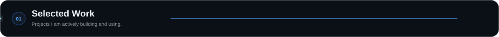

  <picture>
    <source media="(prefers-color-scheme: dark)" srcset="assets/theme-dark/header.svg">
    <source media="(prefers-color-scheme: light)" srcset="assets/header-light-v2.svg">
    
  </picture>

  <picture>
    <source media="(prefers-color-scheme: dark)" srcset="assets/theme-dark/selected-work.svg">
    <source media="(prefers-color-scheme: light)" srcset="assets/sections/selected-work.svg">
    
  </picture>

<a href="https://github.com/ZGMFX01A/OrigRead"><picture><source media="(prefers-color-scheme: dark)" srcset="assets/theme-dark/origread.svg"><source media="(prefers-color-scheme: light)" srcset="assets/cards-v3/origread.svg"></picture></a><a href="https://github.com/ZGMFX01A/OrigRead-Desktop"><picture><source media="(prefers-color-scheme: dark)" srcset="assets/theme-dark/origread-desktop.svg"><source media="(prefers-color-scheme: light)" srcset="assets/cards-v3/origread-desktop.svg"></picture></a>

<a href="https://github.com/ZGMFX01A/Wireless-Device-Battery-Monitor"><picture><source media="(prefers-color-scheme: dark)" srcset="assets/theme-dark/wireless-battery.svg"><source media="(prefers-color-scheme: light)" srcset="assets/cards-v3/wireless-battery.svg"></picture></a><a href="https://github.com/ZGMFX01A/coding-tools-mcp-expand"><picture><source media="(prefers-color-scheme: dark)" srcset="assets/theme-dark/coding-tools-mcp.svg"><source media="(prefers-color-scheme: light)" srcset="assets/cards-v3/coding-tools-mcp.svg"></picture></a>

  <picture>
    <source media="(prefers-color-scheme: dark)" srcset="assets/theme-dark/current-focus.svg">
    <source media="(prefers-color-scheme: light)" srcset="assets/sections/current-focus.svg">
    
  </picture>

  <picture>
    <source media="(prefers-color-scheme: dark)" srcset="assets/theme-dark/focus.svg">
    <source media="(prefers-color-scheme: light)" srcset="assets/focus-light-v2.svg">
    
  </picture>

  <picture>
    <source media="(prefers-color-scheme: dark)" srcset="assets/theme-dark/toolkit.svg">
    <source media="(prefers-color-scheme: light)" srcset="assets/sections/toolkit.svg">
    
  </picture>

  <picture>
    <source media="(prefers-color-scheme: dark)" srcset="assets/theme-dark/toolkit-panel.svg">
    <source media="(prefers-color-scheme: light)" srcset="assets/toolkit-panel.svg">
    
  </picture>

  <picture>
    <source media="(prefers-color-scheme: dark)" srcset="assets/theme-dark/footer.svg">
    <source media="(prefers-color-scheme: light)" srcset="assets/footer.svg">
    
  </picture>

