  

  <a href="https://github.com/ZGMFX01A/OrigRead"><b>OrigRead</b></a>
  &nbsp;·&nbsp;
  <a href="https://github.com/ZGMFX01A/OrigRead-Desktop"><b>Desktop</b></a>
  &nbsp;·&nbsp;
  <a href="https://github.com/ZGMFX01A/code-index-mcp"><b>Code Index MCP</b></a>
  &nbsp;·&nbsp;
  <a href="https://github.com/ZGMFX01A/coding-tools-mcp-expand"><b>Coding Tools MCP</b></a>

 

## `01 // SELECTED_WORK`

<table>
<tr>
<td width="50%" valign="top">

### 📖 OrigRead

**A source-first Android reader for RSS, feeds, news and the wider web.**

RSS / Atom, RSSHub, website parsing, JSON/API sources, full-text extraction, translation and optional AI — without turning reading into an algorithmic recommendation feed.

`Android` `Kotlin` `Jetpack Compose` `RSS` `AI`

**[Explore project →](https://github.com/ZGMFX01A/OrigRead)**

</td>
<td width="50%" valign="top">

### 🖥️ OrigRead Desktop

**The desktop counterpart of OrigRead for Windows, macOS and Linux.**

The same source-first workflow, extended to desktop with subscriptions, parsing rules, full-text reading, translation and AI summaries.

`Electron` `React` `Desktop` `Reader` `AI`

**[Explore project →](https://github.com/ZGMFX01A/OrigRead-Desktop)**

</td>
</tr>
<tr>
<td width="50%" valign="top">

### 🧠 code-index-mcp

**Local code intelligence exposed as an MCP service.**

Qdrant-backed semantic search, pluggable embeddings, tree-sitter chunking, incremental indexing and workspace-aware search for IDEs and AI agents.

`MCP` `Qdrant` `Embeddings` `Tree-sitter` `Node.js`

**[Explore project →](https://github.com/ZGMFX01A/code-index-mcp)**

</td>
<td width="50%" valign="top">

### ⚙️ Coding Tools MCP

**A persistent local development workspace for AI agents.**

Rust + Tauri desktop tooling that exposes files, commands, Git state and remote MCP access while preserving development context across sessions.

`Rust` `Tauri` `MCP` `Git` `Developer Tools`

**[Explore project →](https://github.com/ZGMFX01A/coding-tools-mcp-expand)**

</td>
</tr>
</table>

 

## `02 // CURRENT_SIGNAL`

  

 

## `03 // TOOLKIT`

  

  <code>backend systems</code>&nbsp;&nbsp;
  <code>personal software</code>&nbsp;&nbsp;
  <code>Android / Desktop</code>&nbsp;&nbsp;
  <code>local AI tooling</code>&nbsp;&nbsp;
  <code>MCP</code>

 

---

  <code>build useful things</code> · <code>keep the interface quiet</code> · <code>let the work speak</code>

